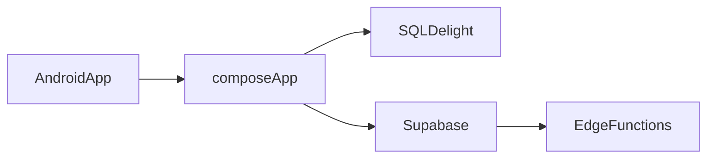
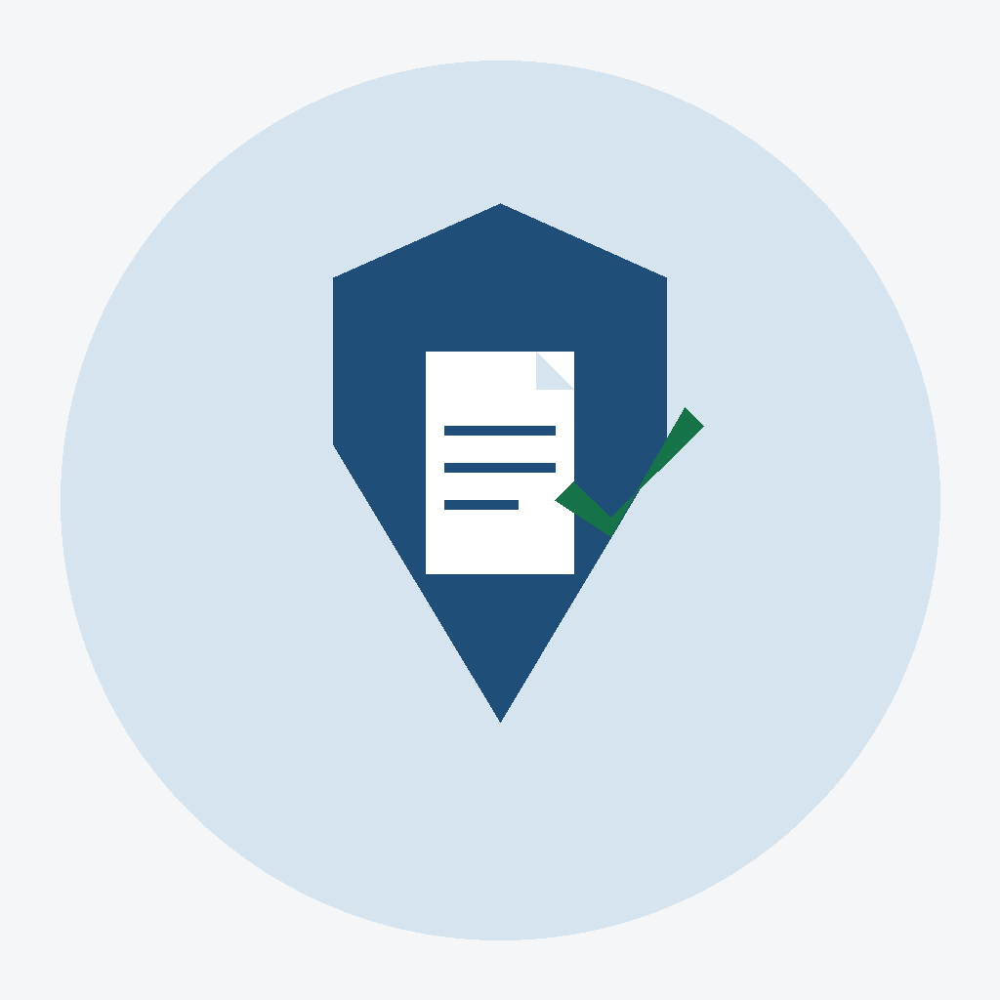
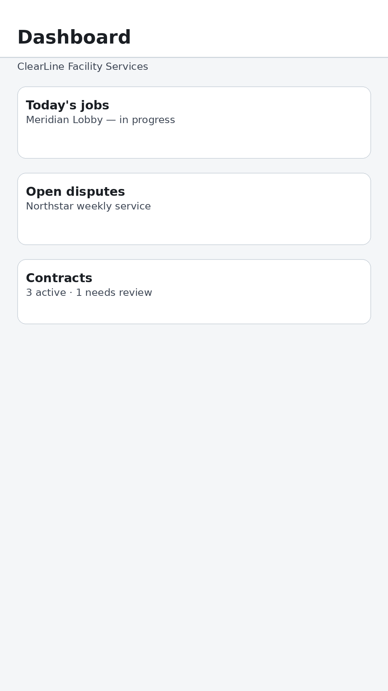
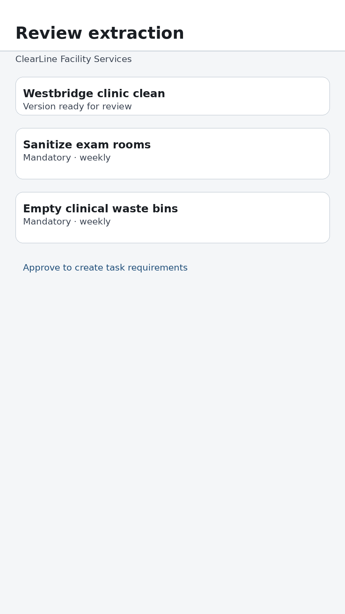
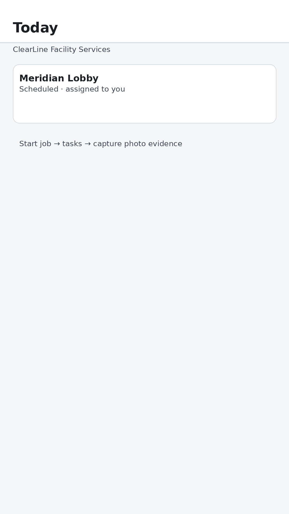
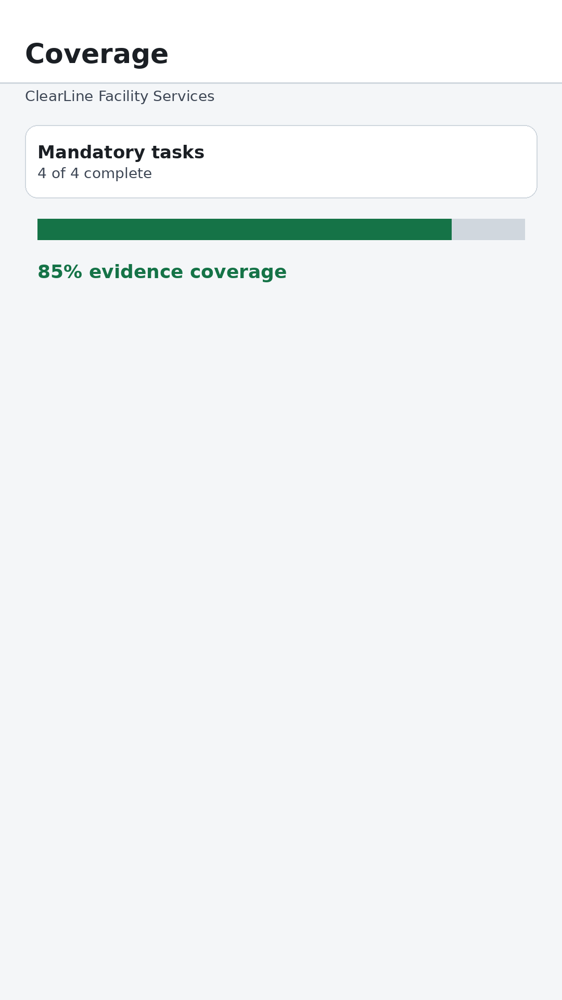
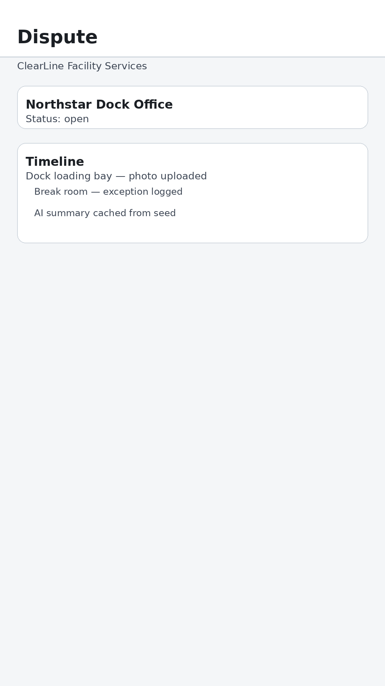
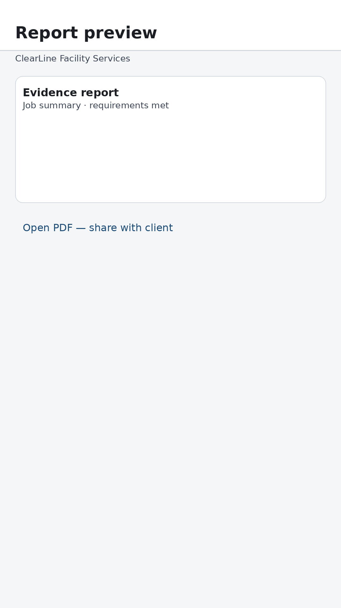
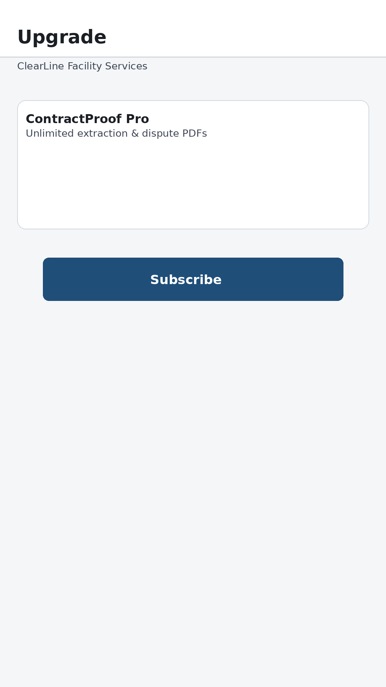

# ContractProof

> **Contracts say what must happen. ContractProof proves what happened.**

**Proof that contracted work was done — with photos, timestamps, and audit-ready reports.**

ContractProof is a **contract evidence and dispute-defense** platform for commercial cleaning and facility teams—not a generic field-service CRM. It turns approved contracts into daily task lists, captures evidence on site, and reconstructs disputes with neutral timelines and PDF reports.

**Hackathon scope:** [MVP freeze](docs/hackathon/mvp-freeze.md) · **Judge demo:** [final golden flow](docs/qa/final-golden-flow.md)

## Problem

Service businesses lose money when work is done but not provable: missing photos, disputed scope, and slow back-office reconstruction.

## Solution

Upload a contract, review AI-extracted requirements, run jobs on mobile with offline capture, and generate evidence reports when clients raise issues.

## Key features

- Contract PDF upload and AI-assisted requirement extraction (human approval required)
- Cleaner workflow: Today → tasks → photo evidence → coverage
- Offline-first capture with sync when connectivity returns
- Dispute reconstruction timeline and evidence report PDF
- Role-based access (owner, manager, cleaner, client)
- Subscriptions via RevenueCat (Free / Pro / Business)

## Why it is different

Evidence rules come from **approved contract versions**, not ad-hoc checklists. The app treats **pending uploads as documented work**, not missing proof. Dispute screens present **recorded facts**, not a legal verdict.

## Technology stack

| Layer | Technology |
|-------|------------|
| Mobile | Kotlin Multiplatform, Compose Multiplatform, Android (APK), iOS ([`iosApp`](iosApp/)) — see [Ship Kotlin Everywhere showcase](docs/kmp/ship-kotlin-everywhere-showcase.md) |
| Local data | SQLDelight, file-backed photo staging |
| Backend | Supabase (Auth, Postgres, Storage, Edge Functions) |
| AI | Gemini (+ Groq fallback) in Edge Functions for extraction and summaries |
| Payments | RevenueCat (Google Play billing / Test Store for APK) |
| Analytics / crashes | PostHog, Sentry (optional) |

## Architecture

Shared mobile core (`composeApp`) with Android shell (`androidApp`) and iOS shell (`iosApp`), talking to one Supabase project. Domain rules and Compose UI live in `commonMain` and are covered by unit tests. iOS compile check: `./gradlew :composeApp:checkIosCompile`. See [docs/architecture/mvp.md](docs/architecture/mvp.md) and [docs/development/ios-build.md](docs/development/ios-build.md).



## Demo instructions

1. Reset Supabase with seed data: `supabase db reset`
2. Create auth users and upload storage assets — [docs/development/demo-mode.md](docs/development/demo-mode.md)
3. Follow the scripted roles — [docs/qa/golden-path-hackathon.md](docs/qa/golden-path-hackathon.md)

Fictional tenant: **ClearLine Facility Services** (`is_demo` rows).

## Download ContractProof APK

**[Download from GitHub Releases](https://github.com/ubturja/ContractProof/releases/latest)** — asset: `ContractProof-1.0.0-1-universal.apk`

| | |
|--|--|
| **Version** | 1.0.0 (version code **1**) |
| **SHA-256** | `3e99efc094185b143590c858429ce2bf256311a07ab4577541553bb9188a5f53` |

Verify after download:

```bash
sha256sum ContractProof-1.0.0-1-universal.apk
# expected: 3e99efc094185b143590c858429ce2bf256311a07ab4577541553bb9188a5f53
```

Full metadata: [docs/release/RELEASE_METADATA.md](docs/release/RELEASE_METADATA.md). Step-by-step: [docs/release/apk-verification.md](docs/release/apk-verification.md).

### Installation

1. Download the APK from the [latest GitHub Release](https://github.com/ubturja/ContractProof/releases/latest).
2. On your phone, allow installation from your browser or files app when prompted.
3. Open **ContractProof** from the launcher and sign in with demo accounts below (requires network to your Supabase project for hackathon judging).
4. Optional (USB): `adb install -r ContractProof-1.0.0-1-universal.apk`

### Android compatibility

| Requirement | Value |
|-------------|--------|
| Minimum Android | **8.0** (API 26) |
| Target SDK | 36 |
| Package | Universal APK (all common CPU ABIs in one file) |
| Permissions | Internet, camera (optional for evidence), notifications (optional) |

Local build (judges/maintainers): `CONTRACTPROOF_USE_DEBUG_SIGNING=true ./scripts/assemble-release-apk.sh` → `dist/`. See [docs/release/final-android-release-report.md](docs/release/final-android-release-report.md).

## Demo accounts

Emails (password in repo docs only, not in the APK):

- `owner@clearline.demo` — contracts, disputes, reports  
- `cleaner@clearline.demo` — Today jobs  
- `client@clearline.demo` — Northstar service + dispute  

Details: [docs/development/demo-data.md](docs/development/demo-data.md).

## RevenueCat

The APK uses the **RevenueCat Test Store** (not Play Store listing). Judges sign in with a test account as documented by RevenueCat. Entitlements gate contract extraction and dispute PDFs on the Free plan. Release builds do not enable demo subscription bypass unless the APK is debug-signed and debuggable.

## AI architecture

The app sends contract **storage references** to Edge Functions. Functions extract PDF text, call Gemini for schema-valid JSON, and persist extractions for **owner approval** before they become task rules. Dispute summaries are optional and cached; the primary demo uses seeded JSON.

## Offline architecture

SQLDelight holds jobs, requirements, and an upload outbox. Photos stay on disk until upload succeeds. UI shows per-item sync state; pending upload does not count as missing evidence.

## App icon

1024×1024 master icon for store listings and hackathon submission (no device frame, no text):



Source: [`docs/design/icon-1024.png`](docs/design/icon-1024.png) · Brand spec: [`docs/design/app-icon.md`](docs/design/app-icon.md)

## Screenshots

Frameless UI captures (ClearLine demo copy) rendered from the real Compose screens. Regenerate: `./scripts/export-marketing-screenshots.sh` (requires a connected emulator). See [docs/qa/screenshots.md](docs/qa/screenshots.md).

| | |
|---|---|
|  | Owner dashboard — jobs, contracts, disputes |
|  | Meridian contract extraction review |
|  | Cleaner Today — Meridian job |
|  | Evidence coverage for active job |
|  | Dispute timeline reconstruction |
|  | Evidence report preview |
|  | Subscription / paywall |

## Demo video

**Hackathon demo (under 2 minutes):** _Add your YouTube or Loom URL here after recording._

Script: [docs/qa/hackathon-demo-video-script.md](docs/qa/hackathon-demo-video-script.md) · Prep: [docs/qa/demo-recording-prep.md](docs/qa/demo-recording-prep.md)

## Hackathon context

Built for a student / Next Gen hackathon track: Android-first MVP demonstrating contract-to-evidence-to-dispute flow with real auth and RLS, plus deterministic ClearLine demo data.

## Project structure

```
androidApp/          Android application entry
iosApp/              SwiftUI shell + Xcode project (CMP framework)
composeApp/          Shared UI, domain, data, sync
supabase/            Migrations, seed, Edge Functions
docs/                Architecture, QA, release notes
scripts/             Release APK build helpers
```

## Development setup

1. JDK **17** (Gradle / Android toolchain)
2. Android SDK (API 37 compile, min 26)
3. Copy `local.properties.example` → `local.properties`
4. Optional: `keystore.properties` from `keystore.properties.example` for release signing

## Environment variables

Build-time keys are read from `local.properties` or the environment (see [local.properties.example](local.properties.example)). Never commit secrets.

## Build instructions

```bash
# Debug
./gradlew :androidApp:assembleDebug

# Universal release APK (output in dist/)
./scripts/assemble-release-apk.sh
```

First run may download JDK 17 into `.jdk17/`. For a judge APK, configure `keystore.properties`; for local install only: `CONTRACTPROOF_USE_DEBUG_SIGNING=true ./scripts/assemble-release-apk.sh`.

Publish steps: [docs/release/publish-github-release.md](docs/release/publish-github-release.md).

## License

MIT — see [LICENSE](LICENSE).
