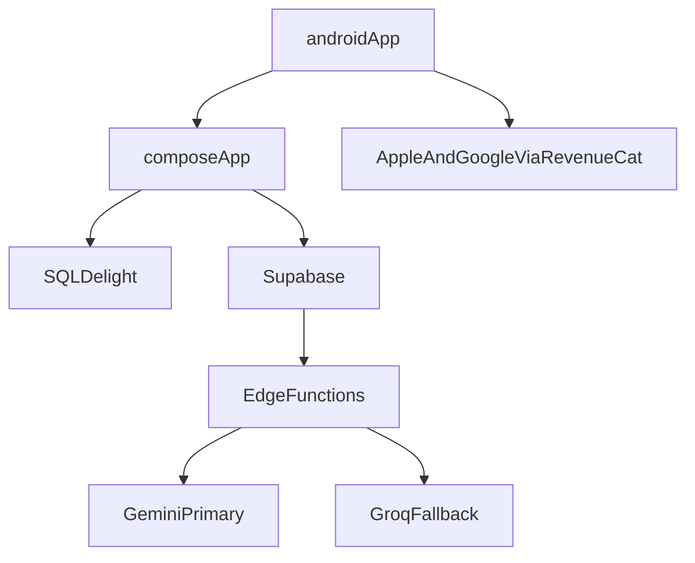

# ContractProof MVP architecture

This document is the architecture for the Android-first MVP. Later prompts implement against it. It does not add Gradle modules, libraries, schema, or feature code.

The running shell already matches the module split: `composeApp` is the shared Compose module, and `androidApp` is the Android entry point (`com.contractproof.app`).

Priorities, in order:

1. Android MVP
2. Offline-first mobile workflow
3. Kotlin Multiplatform and Compose Multiplatform reuse
4. Simple implementation
5. Testability
6. Hackathon execution speed

There is one backend (Supabase) and one mobile app. No microservices, message buses, or extra infrastructure.

## Module structure

Two Gradle modules. Do not add `shared`, `iosApp`, or a web module until a later prompt asks for them.

- `androidApp`: Android process entry only. `MainActivity` calls shared `App()`.
- `composeApp`: shared UI, domain, data, and sync. It is an Android library target today. The iOS target is added later in this same module.
- `supabase/` (later, not a Gradle module): SQL migrations, row-level security, private Storage buckets, and Edge Functions.
- Web portal (later, a separate app): owner, manager, and client in the browser. It uses the same Supabase project. Cleaners stay on Android.



## Package structure

All shared Kotlin lives under `com.contractproof` inside `composeApp/src/commonMain`.

- `app`: composition root, navigation host, and app-level state
- `core`: design tokens, errors, clock, dispatchers, and Koin modules
- `domain`: models, repository interfaces, and use cases
- `data`: repository implementations, remote and local data sources, and sync
- `feature`: one package per product area (`auth`, `contract`, `service`, `evidence`, `dispute`, `subscription`)

Each feature package contains presentation only. Domain and data stay central so business rules can be tested without Compose.

## Presentation, domain, and data

Presentation is Compose screens and one `ViewModel` per screen. UI state is immutable. Screens call use cases. They do not call Supabase, SQLDelight, RevenueCat, or the camera SDK.

Domain is pure Kotlin. It has no Android, SQLDelight, or Supabase types. Use cases cover evidence coverage, service completion, exception acceptance, dispute reconstruction, and entitlement checks. Repository interfaces are the only way out of the domain.

Data implements those interfaces. The phone’s SQLDelight database is the working copy. Supabase is the remote copy. Repositories read local data and enqueue remote work.

Call direction:

```text
feature presentation -> domain use case -> repository interface
                                              |
                                              v
                                    data implementation
                                      |            |
                                 SQLDelight    Supabase
```

## Kotlin Multiplatform shared code

`commonMain` holds UI, domain, data contracts, the sync state machine, and the SQLDelight schema. Platform code is an `expect`/`actual` only for:

- the SQLDelight driver
- the camera
- location
- local files
- connectivity
- purchases

Common code must not reference Android or iOS APIs.

## Android-specific code

`androidMain` and `androidApp` hold:

- `AndroidSqliteDriver`
- CameraX
- location
- app file storage
- Google Play billing and the RevenueCat Test Store through the RevenueCat Android SDK

`MainActivity` stays thin. It sets the Compose content to `App()` and does not contain product rules.

## iOS-specific code

The same `expect` interfaces get `actual` implementations in a future `iosMain`: the SQLDelight native driver, AVFoundation, Core Location, and StoreKit through RevenueCat. No `iosMain` and no Xcode project until a later prompt. Adding those implementations must not require changes to domain use cases.

## Local database

SQLDelight lives in `composeApp`. The schema is added in the offline phase, not in this document.

Cached tables cover organization context, jobs, requirements, evidence metadata, exceptions, and one upload outbox. Photo bytes are file paths, not database blobs.

The local database is the source the UI reads. A missing network does not remove a captured photo or a drafted exception.

## Supabase

Supabase provides Auth, Postgres, private Storage, row-level security, and Edge Functions.

The app may hold the Supabase anon key and the RevenueCat public SDK key. The service-role key, the RevenueCat webhook secret, and the model keys stay in Edge Function secrets.

Row-level security is the tenant boundary. Every business row belongs to one organization. The client does not send a trusted organization id or role. The database derives both from the authenticated user.

Email and password are the first auth method. One organization per user. Roles are owner, manager, cleaner, and client. Until the web portal exists, the owner records a dispute in the Android app.

## AI

The app sends a stored contract file reference to one Edge Function. That function:

1. Extracts the PDF text layer into Markdown.
2. OCRs any page that has no text layer.
3. Asks Gemini for schema-valid JSON.
4. Sends the same Markdown to Groq only when Gemini fails or the free-tier quota is exhausted.

The JSON is stored as an extraction. It becomes evidence rules only after an owner approves it. The model does not create evidence, close a job, or judge a dispute.

Demo mode replays labeled ClearLine seed records. Those records stay marked as demo data.

## RevenueCat

The Android SDK sits behind a domain entitlement port. Feature code asks that port whether extraction or dispute PDFs are allowed. It does not read a hard-coded plan name from the UI.

Entitlements:

- Free: 1 location. Contract extraction and dispute PDFs stay locked.
- Pro: $49/month. Multiple locations, unlimited service records, extraction, evidence validation, dispute reports, and the client portal.
- Business: $99/month. Multiple managers, branded reports, and the additional AI and analytics scope.

Purchases use the RevenueCat Test Store, because this build is distributed as an APK rather than through the Play Store. A demo flag may hide the paywall while a demo is recorded. The build given to judges keeps the real paywall, including restore. When server subscription state is added, it comes from the RevenueCat webhook, not from a flag on the client.

## File storage

Contracts, evidence photos, and generated reports use private Supabase buckets. The app uploads bytes and stores the object path. Reads use short-lived signed URLs. Nothing in these buckets is served from a permanent public URL.

A photo that has not synced remains in app files. The outbox points at that file. The local file is eligible for cleanup only after the outbox item is `uploaded`.

## Synchronization

One outbox table in SQLDelight. Each item is `pending`, `uploading`, `uploaded`, `failed`, or `retrying`.

The sync worker sends the outbox when connectivity returns. It retries failed items. Assigned jobs and their requirements are cached before the cleaner starts work. Evidence already on the device is kept when the upload fails.

The UI shows the sync state on the evidence item. It does not treat a pending upload as missing evidence, and it does not treat a failed upload as captured on the server.

## Tests

Domain use cases run as `commonTest` tests with in-memory fakes. Evidence coverage, service completion, exception acceptance, dispute reconstruction, and entitlement checks do not need SQLDelight, Supabase, or a device.

## Not in this step

No new Kotlin source, no database schema, no Edge Functions, no Koin wiring, no SQLDelight dependency, no RevenueCat SDK, and no web app. Those land in later prompts that follow this document.
