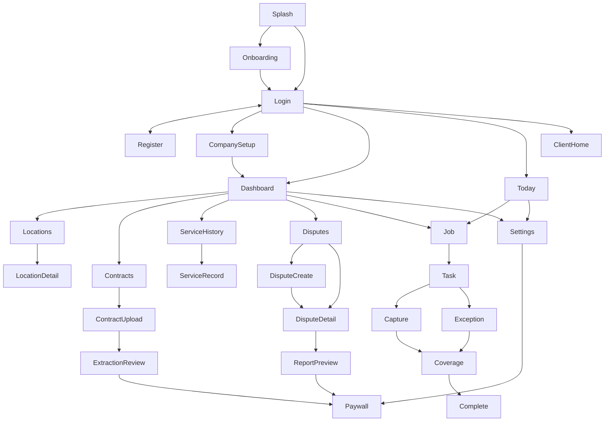
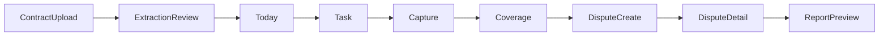

# ContractProof navigation specification

This is the Android MVP information architecture. Routes named here are the future type-safe destinations in `com.contractproof.app`. They are not Kotlin types yet. This document does not add screens or the Navigation Compose dependency.

Two shells exist after sign-in. Owner and manager share one shell. Cleaners use the other. A client who signs in on Android sees a single holding screen. Contract review, acknowledgement, and filing a dispute as the client belong to the later web portal. Until that portal exists, the owner records the dispute in the Android app.

## Authentication flow

`Splash` checks the session.

- No session, first launch: `Onboarding`, then `Login`.
- No session, later launch: `Login`.
- `Login` and `Register` exchange with each other.

After register or login:

- Owner with no organization goes to `CompanySetup`, then `Dashboard`.
- Owner or manager with an organization goes to `Dashboard`.
- Cleaner goes to `Today`.
- Client goes to `ClientHome`.

`CompanySetup` is owner-only and runs once.

## Owner and manager flow

`Dashboard` is the owner home. It shows evidence-coverage alerts, open disputes, and today’s jobs. From it:

- `Locations` opens `LocationDetail`.
- `Contracts` opens `ContractUpload`, which opens `ExtractionReview`.
- `ServiceHistory` opens a read-only `ServiceRecord`.
- `Disputes` opens `DisputeCreate`, or `DisputeDetail`, which opens `ReportPreview`.
- `Settings` is available from the shell.

A manager uses this same shell and can open assigned locations, service records, evidence, and disputes. Company setup, subscription management, and inviting owners stay owner-only. There is no separate manager graph.

## Cleaner flow

`Today` lists the assigned job. `Job` lists that job’s requirements. `Task` offers one next action: `Capture` or `Exception`. `Coverage` shows the percent and the missing items. `Complete` is enabled only when every mandatory requirement is satisfied by evidence or an exception.

Back from `Capture` or `Exception` returns to `Task`, then to `Coverage`.

The cleaner does not open contracts, billing, or dispute reports.

## Client flow

A signed-in **client** lands on `ClientHome` (completed service list). They open `ClientServiceRecord` for a read-only timeline (tasks, evidence, exceptions, acknowledgements), then `ClientDisputeCreate` and `ClientDisputeConfirmation` to file an issue. Clients do not open the owner dashboard, contracts, or cleaner job execution. Sign out is on the client home title bar.

## Contract flow

`Contracts` to `ContractUpload` (PDF or manual entry) to `ExtractionReview`.

Review can edit extracted requirements. Approve is an explicit action on that screen. Approval is what turns an extraction into evidence rules. Leaving review without approval keeps the extraction unapproved.

## Service flow

The owner opens a job from `Dashboard`. The cleaner opens it from `Today`. Both land on `Job`. Each requirement opens `Task`. After the work is finished, the owner reads the same job on `ServiceRecord`.

## Evidence flow

`Capture` writes a local evidence item and shows its sync state: `pending`, `uploading`, `uploaded`, `failed`, or `retrying`. `Exception` records the reason against that requirement. `Coverage` recalculates from local records. A pending upload is not treated as missing evidence. A failed upload is not treated as stored on the server.

## Dispute flow

`DisputeCreate` collects the client, location, date, and complaint text. `DisputeDetail` shows a neutral timeline: the requirement, the scheduled job, the worker, timestamps, evidence, exceptions, and what is missing. The screen does not declare a winner. `ReportPreview` is the generated evidence report.

Generate stays disabled when the Free entitlement blocks dispute PDFs. That action sends the user to `Paywall`.

## Subscription flow

`Paywall` opens from `Settings`, and also when a gated action is tapped: a second location, contract extraction, or a dispute PDF. The actions on the paywall are purchase and restore.

A demo flag may skip the gate while a demo is recorded. The build given to judges still includes this route.

## Settings flow

`Settings` is available from both shells. It includes the account, the organization for an owner, sync status, sign out, and the subscription entry that opens `Paywall`.

## Screen map

## Golden demo path

This is the path that must stay short enough for a two-minute demo:

Demo mode may switch from the owner shell to the cleaner shell and back without extra screens. It uses these same routes. There are no demo-only destinations.

## Screen list

Auth: `Splash`, `Onboarding`, `Login`, `Register`, `CompanySetup`, `ClientHome`.

Owner shell: `Dashboard`, `Locations`, `LocationDetail`, `Contracts`, `ContractUpload`, `ExtractionReview`, `ServiceHistory`, `ServiceRecord`, `Disputes`, `DisputeCreate`, `DisputeDetail`, `ReportPreview`.

Cleaner shell: `Today`, `Job`, `Task`, `Capture`, `Exception`, `Coverage`, `Complete`.

Shared: `Settings`, `Paywall`.
