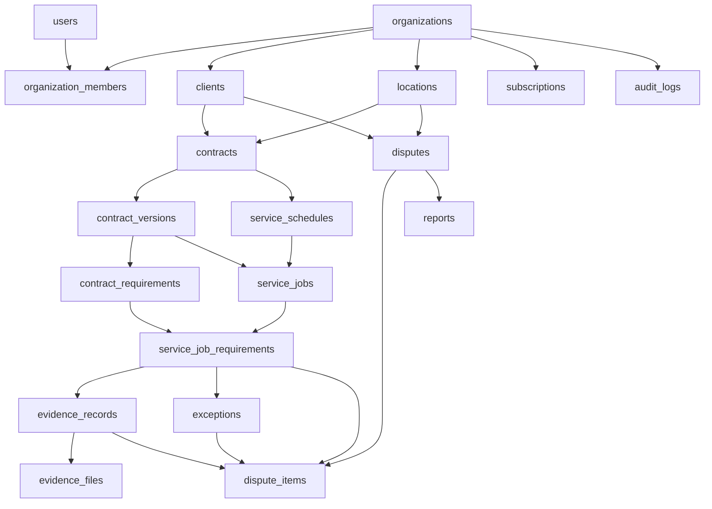

# ContractProof PostgreSQL schema

This document is the migration design for the Supabase Postgres database. It follows [mvp.md](mvp.md). It does not create a `supabase/` directory, apply SQL, add SQLDelight, or change the app.

The phone outbox stays in SQLDelight when the offline phase arrives. It is not a table here. Model output stays on `contract_versions` until an owner approves it. There is no extractions table.

Nineteen tables:

`organizations`, `users`, `organization_members`, `clients`, `locations`, `contracts`, `contract_versions`, `contract_requirements`, `service_schedules`, `service_jobs`, `service_job_requirements`, `evidence_records`, `evidence_files`, `exceptions`, `disputes`, `dispute_items`, `reports`, `subscriptions`, `audit_logs`.

## Conventions

Every primary key is `uuid`. A device may generate the id before the network returns. Server-created rows use `gen_random_uuid()`.

Every business table except `users` has `organization_id uuid not null` and `unique (organization_id, id)`. Foreign keys use that pair. A job cannot point at another organization's contract, requirement, evidence, or dispute. `users` carries no organization. Membership does.

`created_at` and `updated_at` are `timestamptz not null default now()`. `private.touch_updated_at()` sets `updated_at` on update. `audit_logs`, `contract_versions`, `contract_requirements`, and `dispute_items` have `created_at` only. Those rows are snapshots.

Status and role values are `text` with `check` constraints. Names used below are the constraint names.

`private.current_membership()` is `stable` and `security definer`. It reads `auth.uid()` and returns that user's `organization_id`, `role`, `location_ids`, and `client_id`. Row-level security calls it, so `authenticated` can execute that function. The client does not send a trusted organization id or role. Applied grants are in [rls.md](rls.md).

Storage buckets `contracts`, `evidence`, `dispute-attachments`, and `reports` are private. Tables store the bucket and object path. They do not store a public URL.

## Shared checks

Device-originated rows use `sync_status`:

```text
pending | uploading | uploaded | failed | retrying
```

Constraint name: `sync_status_known`. Used on `service_jobs`, `evidence_records`, `evidence_files`, `exceptions`, and `disputes`.

A row counts as stored on the server only when `sync_status` is `uploaded`. `pending`, `uploading`, `failed`, and `retrying` may exist so a retry keeps the same id. Coverage and dispute outcomes ignore every other status.

Server-created jobs default `sync_status` to `uploaded`. Evidence, exceptions, and disputes have no default. The device sends the status with the id it already saved locally.

User references (`created_by`, `approved_by`, `assigned_user_id`, `completed_by`, `captured_by`, `recorded_by`, `generated_by`, `actor_user_id`) point at `users(id)`. `private.reject_cross_tenant_user()` rejects a user whose membership organization differs from the row. A null user is allowed only where the column is nullable. `audit_logs.actor_user_id` may be null for a webhook.

## organizations

The tenant. The plan name lives on `subscriptions`, not here.

| Column | Type | Constraints |
| --- | --- | --- |
| `id` | `uuid` | primary key, default `gen_random_uuid()` |
| `name` | `text` | `not null`, `char_length(name) > 0` (`organization_name_present`) |
| `created_by` | `uuid` | `not null`, foreign key → `users(id)` |
| `created_at` | `timestamptz` | `not null default now()` |
| `updated_at` | `timestamptz` | `not null default now()` |

`created_by` is added after `users` exists. Inserting an organization also inserts its free `subscriptions` row through `private.seed_free_subscription()`.

Index: primary key.

## users

Profile for `auth.users`. Email and password stay in Supabase Auth.

| Column | Type | Constraints |
| --- | --- | --- |
| `id` | `uuid` | primary key, foreign key → `auth.users(id)` on delete cascade |
| `email` | `text` | `not null`, unique, `char_length(email) > 0` (`user_email_present`) |
| `display_name` | `text` | `not null`, `char_length(display_name) > 0` (`user_display_name_present`) |
| `created_at` | `timestamptz` | `not null default now()` |
| `updated_at` | `timestamptz` | `not null default now()` |

Index: unique `email`.

## organization_members

One organization per user. Roles are `owner`, `manager`, `cleaner`, and `client`.

| Column | Type | Constraints |
| --- | --- | --- |
| `id` | `uuid` | primary key, default `gen_random_uuid()` |
| `organization_id` | `uuid` | `not null`, foreign key `(organization_id)` → `organizations(id)` |
| `user_id` | `uuid` | `not null`, foreign key → `users(id)`, unique (`one_organization_per_user`) |
| `role` | `text` | `not null`, `role in ('owner','manager','cleaner','client')` (`member_role_known`) |
| `client_id` | `uuid` | nullable |
| `location_ids` | `uuid[]` | `not null default '{}'` |
| `created_at` | `timestamptz` | `not null default now()` |
| `updated_at` | `timestamptz` | `not null default now()` |

Also `unique (organization_id, id)` and `unique (organization_id, user_id)`.

`client_id` foreign key `(organization_id, client_id)` → `clients(organization_id, id)` is added after `clients` exists. `member_client_link`:

- `role = 'client'` requires `client_id` and `cardinality(location_ids) = 0`.
- `role = 'owner'` requires `client_id is null` and `cardinality(location_ids) = 0`. An empty array means every location.
- `role = 'manager'` requires `client_id is null`. `location_ids` is the allow list. Empty means no locations, not every location.
- `role = 'cleaner'` requires `client_id is null`. Job assignment is `service_jobs.assigned_user_id`. `location_ids` is unused and must be empty.

`private.member_locations_in_org()` rejects any `location_ids` element that is not a location in the same organization.

Indexes: unique `user_id`, unique `(organization_id, user_id)`, GIN on `location_ids`.

## clients

The customer named on a contract. This is not an auth user. A later client login points here through `organization_members.client_id`.

| Column | Type | Constraints |
| --- | --- | --- |
| `id` | `uuid` | primary key, default `gen_random_uuid()` |
| `organization_id` | `uuid` | `not null` |
| `name` | `text` | `not null`, `char_length(name) > 0` (`client_name_present`) |
| `status` | `text` | `not null default 'active'`, `status in ('active','archived')` (`client_status_known`) |
| `created_at` | `timestamptz` | `not null default now()` |
| `updated_at` | `timestamptz` | `not null default now()` |

`unique (organization_id, id)`. Foreign key `(organization_id)` → `organizations(id)`.

Indexes: unique `(organization_id, id)`, `(organization_id, status)`.

## locations

A place where service runs. The free plan's limit of one location is an entitlement check in the app. It is not a row constraint, because a subscription can change.

| Column | Type | Constraints |
| --- | --- | --- |
| `id` | `uuid` | primary key, default `gen_random_uuid()` |
| `organization_id` | `uuid` | `not null` |
| `client_id` | `uuid` | `not null` |
| `name` | `text` | `not null`, `char_length(name) > 0` (`location_name_present`) |
| `timezone` | `text` | `not null`, `char_length(timezone) > 0` (`location_timezone_present`) |
| `address` | `text` | nullable |
| `zone_code` | `text` | nullable. A future service zone. Empty is stored as null. |
| `identifier_kind` | `text` | nullable, `identifier_kind in ('qr','nfc')` (`location_identifier_kind_known`) |
| `identifier_value` | `text` | nullable |
| `status` | `text` | `not null default 'active'`, `status in ('active','archived')` (`location_status_known`) |
| `created_at` | `timestamptz` | `not null default now()` |
| `updated_at` | `timestamptz` | `not null default now()` |

`unique (organization_id, id)`. Foreign keys: `(organization_id)` → `organizations(id)`, `(organization_id, client_id)` → `clients (organization_id, id)`. `timezone` is an IANA name. `location_identifier_pair` requires `identifier_kind` and `identifier_value` to be both null or both present. The app does not write those two columns yet.

Indexes: unique `(organization_id, id)`, `(organization_id, status)`, `(organization_id, client_id)`.

## subscriptions

One row per organization. The RevenueCat webhook is the only writer after the free seed row. `authenticated` cannot insert, update, or delete.

| Column | Type | Constraints |
| --- | --- | --- |
| `id` | `uuid` | primary key, default `gen_random_uuid()` |
| `organization_id` | `uuid` | `not null`, unique (`one_subscription_per_organization`) |
| `plan` | `text` | `not null default 'free'`, `plan in ('free','pro','business')` (`subscription_plan_known`) |
| `status` | `text` | `not null default 'active'`, `status in ('active','expired','cancelled','billing_issue')` (`subscription_status_known`) |
| `revenuecat_app_user_id` | `text` | nullable |
| `revenuecat_entitlement_id` | `text` | nullable |
| `current_period_ends_at` | `timestamptz` | nullable |
| `last_event_id` | `text` | nullable, unique (`subscription_event_once`) |
| `source` | `text` | `not null default 'seed'`, `source in ('webhook','seed')` (`subscription_source_known`) |
| `created_at` | `timestamptz` | `not null default now()` |
| `updated_at` | `timestamptz` | `not null default now()` |

`unique (organization_id, id)`. Foreign key `(organization_id)` → `organizations(id)`.

`last_event_id` makes a repeated webhook a no-op. Several nulls are allowed, so the seed row does not need an event id. A webhook update sets `source` to `webhook`.

Indexes: unique `organization_id`, unique `last_event_id`.

## contracts

The stable contract identity. Version content lives on `contract_versions`.

| Column | Type | Constraints |
| --- | --- | --- |
| `id` | `uuid` | primary key, default `gen_random_uuid()` |
| `organization_id` | `uuid` | `not null` |
| `client_id` | `uuid` | `not null` |
| `location_id` | `uuid` | `not null` |
| `title` | `text` | `not null`, `char_length(title) > 0` (`contract_title_present`) |
| `status` | `text` | `not null default 'draft'`, `status in ('draft','active','ended')` (`contract_status_known`) |
| `current_version_id` | `uuid` | nullable |
| `is_demo` | `boolean` | `not null default false` |
| `created_at` | `timestamptz` | `not null default now()` |
| `updated_at` | `timestamptz` | `not null default now()` |

`unique (organization_id, id)`.

Foreign keys:

- `(organization_id)` → `organizations(id)`
- `(organization_id, client_id)` → `clients(organization_id, id)`
- `(organization_id, location_id)` → `locations(organization_id, id)`
- `(organization_id, id, current_version_id)` → `contract_versions(organization_id, contract_id, id)`, added after versions exist

The last foreign key uses the contract's own `id` as `contract_versions.contract_id`. The current version cannot belong to another contract. Null `current_version_id` skips the check.

`contract_current_version_agrees`: `status = 'draft'` requires `current_version_id is null`. `status = 'active'` requires `current_version_id is not null`.

Indexes: unique `(organization_id, id)`, `(organization_id, status)`, `(organization_id, client_id)`, `(organization_id, location_id)`.

## contract_versions

An immutable published snapshot, plus the in-review upload that precedes it. `extraction` holds the model JSON until approval. Approval copies the edited requirements into `contract_requirements` and freezes this row.

| Column | Type | Constraints |
| --- | --- | --- |
| `id` | `uuid` | primary key, default `gen_random_uuid()` |
| `organization_id` | `uuid` | `not null` |
| `contract_id` | `uuid` | `not null` |
| `version_number` | `integer` | `not null`, `version_number >= 1` (`version_number_positive`) |
| `status` | `text` | `not null default 'uploaded'`, `status in ('uploaded','extracted','approved','superseded')` (`version_status_known`) |
| `bucket` | `text` | nullable |
| `object_path` | `text` | nullable |
| `extraction` | `jsonb` | nullable |
| `approved_at` | `timestamptz` | nullable |
| `approved_by` | `uuid` | nullable, foreign key → `users(id)` |
| `is_demo` | `boolean` | `not null default false` |
| `created_at` | `timestamptz` | `not null default now()` |

`unique (organization_id, id)`. `unique (organization_id, contract_id, id)`. `unique (contract_id, version_number)` named `one_number_per_contract`.

Foreign key `(organization_id, contract_id)` → `contracts(organization_id, id)`.

`version_file_pair`: `bucket` and `object_path` are both null or both present. A manual contract has neither. A PDF uses bucket `contracts`.

`version_approval_pair`: `status in ('approved','superseded')` requires `approved_at` and `approved_by`. Earlier statuses require both null.

Partial unique indexes:

- `one_approved_version`: unique `(organization_id, contract_id)` where `status = 'approved'`
- `one_version_in_review`: unique `(organization_id, contract_id)` where `status in ('uploaded','extracted')`

Approving a replacement sets the previous approved row to `superseded` in the same transaction, then sets `contracts.current_version_id` and `contracts.status` to `active`.

`private.freeze_approved_version()` rejects updates once `status` is `approved`, except the single change to `superseded`. `contract_id`, `version_number`, `bucket`, `object_path`, `extraction`, `approved_at`, `approved_by`, and `is_demo` never change after approval. `is_demo` is copied from the contract at insert.

Indexes: the unique keys above, plus `(organization_id, contract_id, version_number)`.

## contract_requirements

Evidence rules for one version. The owner may edit them while that version is `uploaded` or `extracted`. Approval freezes them.

| Column | Type | Constraints |
| --- | --- | --- |
| `id` | `uuid` | primary key, default `gen_random_uuid()` |
| `organization_id` | `uuid` | `not null` |
| `contract_version_id` | `uuid` | `not null` |
| `sort_order` | `integer` | `not null`, `sort_order >= 0` (`requirement_sort_nonnegative`) |
| `requirement_text` | `text` | `not null`, `char_length(requirement_text) > 0` (`requirement_text_present`) |
| `requires_photo` | `boolean` | `not null` |
| `is_mandatory` | `boolean` | `not null default true` |
| `source` | `text` | `not null`, `source in ('manual','extraction')` (`requirement_source_known`) |
| `extraction_key` | `text` | nullable |
| `created_at` | `timestamptz` | `not null default now()` |

`unique (organization_id, id)`. `unique (organization_id, contract_version_id, id)`. `unique (contract_version_id, sort_order)` named `requirement_order_once`.

Foreign key `(organization_id, contract_version_id)` → `contract_versions(organization_id, id)`.

`private.freeze_approved_requirements()` rejects insert, update, and delete while the parent version is `approved` or `superseded`. There is no `updated_at`. Pre-approval edits replace the row contents in place.

Indexes: unique `(organization_id, contract_version_id, id)`, `(organization_id, contract_version_id, sort_order)`.

## service_schedules

A weekly visit on one contract and location. Job generation uses the location timezone.

| Column | Type | Constraints |
| --- | --- | --- |
| `id` | `uuid` | primary key, default `gen_random_uuid()` |
| `organization_id` | `uuid` | `not null` |
| `contract_id` | `uuid` | `not null` |
| `location_id` | `uuid` | `not null` |
| `frequency` | `text` | `not null default 'weekly'`, `daily` \| `weekdays` \| `weekly` (`schedule_frequency_known`) |
| `weekday` | `smallint` | `not null`, `weekday between 1 and 7` (`schedule_weekday_iso`); required for `weekly` |
| `start_time` | `time` | `not null` |
| `end_time` | `time` | `not null` |
| `timezone` | `text` | `not null`, `char_length(timezone) > 0` (`schedule_timezone_present`) |
| `starts_on` | `date` | `not null` |
| `ends_on` | `date` | nullable |
| `status` | `text` | `not null default 'active'`, `status in ('active','paused','ended')` (`schedule_status_known`) |
| `created_at` | `timestamptz` | `not null default now()` |
| `updated_at` | `timestamptz` | `not null default now()` |

`unique (organization_id, id)`. `schedule_time_order`: `end_time > start_time`. `schedule_date_order`: `ends_on is null or ends_on >= starts_on`.

Foreign keys:

- `(organization_id, contract_id)` → `contracts(organization_id, id)`
- `(organization_id, location_id)` → `locations(organization_id, id)`

`private.schedule_matches_contract_location()` requires `location_id` to equal the contract's `location_id`.

Indexes: unique `(organization_id, id)`, `(organization_id, contract_id)`, `(organization_id, status)`.

## service_jobs

One visit. `contract_version_id` is pinned when the job is created. A later approval does not move this job onto the new version.

| Column | Type | Constraints |
| --- | --- | --- |
| `id` | `uuid` | primary key |
| `organization_id` | `uuid` | `not null` |
| `location_id` | `uuid` | `not null` |
| `client_id` | `uuid` | `not null` |
| `contract_id` | `uuid` | `not null` |
| `contract_version_id` | `uuid` | `not null` |
| `schedule_id` | `uuid` | nullable |
| `assigned_user_id` | `uuid` | nullable, foreign key → `users(id)` |
| `scheduled_start` | `timestamptz` | `not null` |
| `scheduled_end` | `timestamptz` | `not null` |
| `status` | `text` | `not null default 'scheduled'`, `status in ('scheduled','in_progress','completed','cancelled','incomplete','disputed')` (`job_status_known`) |
| `started_at` | `timestamptz` | nullable |
| `completed_at` | `timestamptz` | nullable |
| `completed_by` | `uuid` | nullable, foreign key → `users(id)` |
| `sync_status` | `text` | `not null default 'uploaded'`, `sync_status_known` |
| `is_demo` | `boolean` | `not null default false` |
| `created_at` | `timestamptz` | `not null default now()` |
| `updated_at` | `timestamptz` | `not null default now()` |

The device may supply `id` when it completes a cached job. Server-generated jobs use `gen_random_uuid()`.

`unique (organization_id, id)`. `unique (organization_id, id, contract_version_id)` named `job_version_key`, so child rows can pin the same version.

`job_window`: `scheduled_end > scheduled_start`. `job_completion_pair`: `completed` and `disputed` require `started_at`, `completed_at`, and `completed_by`. `in_progress` and `incomplete` require `started_at` and null completion fields. `scheduled` requires null `started_at` and null completion fields. `cancelled` requires null `completed_at` and `completed_by`.

Foreign keys:

- `(organization_id, location_id)` → `locations(organization_id, id)`
- `(organization_id, client_id)` → `clients(organization_id, id)`
- `(organization_id, contract_id)` → `contracts(organization_id, id)`
- `(organization_id, contract_id, contract_version_id)` → `contract_versions(organization_id, contract_id, id)`
- `(organization_id, schedule_id)` → `service_schedules(organization_id, id)`

`private.job_matches_contract()` requires the job's `client_id` and `location_id` to match the contract, and the pinned version's `status` to be `approved` at insert time. `is_demo` is copied from the contract.

Unique `(organization_id, schedule_id, scheduled_start)` where `schedule_id is not null`, named `one_job_per_occurrence`.

Indexes: unique `(organization_id, id)`, `(organization_id, assigned_user_id, scheduled_start)`, `(organization_id, location_id, scheduled_start)`, `(organization_id, status)`, `(organization_id, contract_id)`.

## service_job_requirements

The requirement text copied from the pinned version at job creation. Dispute reconstruction reads this snapshot, not the live contract.

| Column | Type | Constraints |
| --- | --- | --- |
| `id` | `uuid` | primary key, default `gen_random_uuid()` |
| `organization_id` | `uuid` | `not null` |
| `service_job_id` | `uuid` | `not null` |
| `contract_requirement_id` | `uuid` | `not null` |
| `requirement_text` | `text` | `not null`, `char_length(requirement_text) > 0` (`job_requirement_text_present`) |
| `requires_photo` | `boolean` | `not null` |
| `is_mandatory` | `boolean` | `not null` |
| `sort_order` | `integer` | `not null`, `sort_order >= 0` (`job_requirement_sort_nonnegative`) |
| `status` | `text` | `not null default 'missing'`, `status in ('missing','satisfied','exception')` (`job_requirement_status_known`) |
| `created_at` | `timestamptz` | `not null default now()` |
| `updated_at` | `timestamptz` | `not null default now()` |

`unique (organization_id, id)`. `unique (organization_id, service_job_id, id)` named `job_requirement_key`. `unique (service_job_id, contract_requirement_id)` named `requirement_once_per_job`.

Foreign keys:

- `(organization_id, service_job_id)` → `service_jobs(organization_id, id)`
- `(organization_id, contract_requirement_id)` → `contract_requirements(organization_id, id)`

`private.job_requirement_matches_version()` requires `contract_requirement_id` to belong to `service_jobs.contract_version_id`. Copied text, photo flag, mandatory flag, and sort order do not change after insert. `status` may change.

Server `status` becomes `satisfied` only when that requirement's `evidence_files.sync_status` is `uploaded`. It becomes `exception` only when that requirement's `exceptions.sync_status` is `uploaded`. Otherwise it stays `missing`. A device-only photo does not flip the server row.

Indexes: unique `(organization_id, service_job_id, id)`, `(organization_id, service_job_id)`, `(organization_id, status)`.

## evidence_records

Provenance for one capture. The bytes live in `evidence_files`. One requirement has one evidence row. A retry updates this id. It does not insert another row.

| Column | Type | Constraints |
| --- | --- | --- |
| `id` | `uuid` | primary key |
| `organization_id` | `uuid` | `not null` |
| `service_job_id` | `uuid` | `not null` |
| `service_job_requirement_id` | `uuid` | `not null` |
| `evidence_type` | `text` | `not null`, `evidence_type_known` (`photo`, `checklist_completion`, `timestamp`) |
| `location_id` | `uuid` | nullable, foreign key → `locations(organization_id, id)` |
| `captured_by` | `uuid` | `not null`, foreign key → `users(id)` |
| `captured_at` | `timestamptz` | `not null` |
| `received_at` | `timestamptz` | nullable |
| `latitude` | `double precision` | nullable |
| `longitude` | `double precision` | nullable |
| `horizontal_accuracy_meters` | `double precision` | nullable |
| `sync_status` | `text` | `not null`, `sync_status_known` |
| `is_demo` | `boolean` | `not null default false` |
| `created_at` | `timestamptz` | `not null default now()` |
| `updated_at` | `timestamptz` | `not null default now()` |

`unique (organization_id, id)`. `unique (organization_id, service_job_requirement_id)` named `one_evidence_per_requirement`. `unique (organization_id, service_job_requirement_id, id)` named `evidence_requirement_key`.

`evidence_coordinates`: latitude and longitude are both null or both inside `-90..90` and `-180..180`. `evidence_accuracy`: `horizontal_accuracy_meters is null or horizontal_accuracy_meters >= 0`. Accuracy requires coordinates. `evidence_received`: `sync_status = 'uploaded'` requires `received_at`. Every other status requires `received_at is null`.

Foreign key `(organization_id, service_job_id, service_job_requirement_id)` → `service_job_requirements(organization_id, service_job_id, id)`.

`captured_by`, `captured_at`, coordinates, and accuracy do not change after insert. Updates may change `sync_status`, `received_at`, and `updated_at` only. `is_demo` is copied from the job at insert.

Indexes: unique `(organization_id, service_job_requirement_id)`, `(organization_id, service_job_id)`, `(organization_id, captured_by, captured_at)`.

## evidence_files

The private object for one evidence record. The photo is server evidence only when `sync_status` is `uploaded`.

| Column | Type | Constraints |
| --- | --- | --- |
| `id` | `uuid` | primary key |
| `organization_id` | `uuid` | `not null` |
| `evidence_record_id` | `uuid` | `not null` |
| `bucket` | `text` | `not null default 'evidence'`, `bucket = 'evidence'` (`evidence_bucket_known`) |
| `object_path` | `text` | `not null`, `char_length(object_path) > 0` (`evidence_path_present`) |
| `mime_type` | `text` | `not null`, `char_length(mime_type) > 0` (`evidence_mime_present`) |
| `byte_size` | `bigint` | `not null`, `byte_size > 0` (`evidence_byte_size_positive`) |
| `sha256` | `text` | `not null`, `sha256 ~ '^[0-9a-f]{64}$'` (`evidence_sha256_hex`) |
| `sync_status` | `text` | `not null`, `sync_status_known` |
| `uploaded_at` | `timestamptz` | nullable |
| `created_at` | `timestamptz` | `not null default now()` |
| `updated_at` | `timestamptz` | `not null default now()` |

`unique (organization_id, id)`. `unique (evidence_record_id)` named `one_file_per_evidence`. `unique (bucket, object_path)` named `evidence_object_once`.

Foreign key `(organization_id, evidence_record_id)` → `evidence_records(organization_id, id)`.

`evidence_file_uploaded`: `sync_status = 'uploaded'` requires `uploaded_at`. Other statuses require `uploaded_at is null`.

`bucket`, `object_path`, `mime_type`, `byte_size`, and `sha256` do not change after insert. A retry changes `sync_status` and `uploaded_at` only.

Indexes: unique `evidence_record_id`, unique `(bucket, object_path)`, `(organization_id, sync_status)`.

Objects live in the private Supabase Storage bucket `evidence` at `object_path`. `storage.objects` policies restrict paths to `{organization_id}/{service_job_id}/{service_job_requirement_id}/{evidence_record_id}` for members; cleaners may write on assigned jobs only.

## exceptions

The recorded reason a requirement was not performed as specified. One requirement has one exception. A retry updates this id.

| Column | Type | Constraints |
| --- | --- | --- |
| `id` | `uuid` | primary key |
| `organization_id` | `uuid` | `not null` |
| `service_job_id` | `uuid` | `not null` |
| `service_job_requirement_id` | `uuid` | `not null` |
| `recorded_by` | `uuid` | `not null`, foreign key → `users(id)` |
| `recorded_at` | `timestamptz` | `not null` |
| `reason` | `text` | `not null`, `char_length(reason) > 0` (`exception_reason_present`) |
| `sync_status` | `text` | `not null`, `sync_status_known` |
| `created_at` | `timestamptz` | `not null default now()` |
| `updated_at` | `timestamptz` | `not null default now()` |

`unique (organization_id, id)`. `unique (organization_id, service_job_requirement_id)` named `one_exception_per_requirement`. `unique (organization_id, service_job_requirement_id, id)` named `exception_requirement_key`.

Foreign key `(organization_id, service_job_id, service_job_requirement_id)` → `service_job_requirements(organization_id, service_job_id, id)`.

`recorded_by`, `recorded_at`, and `reason` do not change after insert. Updates may change `sync_status` and `updated_at` only.

A requirement must not have an uploaded evidence file and an uploaded exception together. The two unique keys stop a second row of either kind. Coverage treats uploaded evidence and an uploaded exception as mutually exclusive when it sets `service_job_requirements.status`.

Indexes: unique `(organization_id, service_job_requirement_id)`, `(organization_id, service_job_id)`.

## disputes

The complaint the owner records. Items below are the factual snapshot. The dispute does not declare a winner.

| Column | Type | Constraints |
| --- | --- | --- |
| `id` | `uuid` | primary key |
| `organization_id` | `uuid` | `not null` |
| `client_id` | `uuid` | `not null` |
| `location_id` | `uuid` | `not null` |
| `service_date` | `date` | `not null` |
| `complaint` | `text` | `not null`, `char_length(complaint) > 0` (`dispute_complaint_present`) |
| `service_job_id` | `uuid` | nullable in migration; required for new rows from the app |
| `disputed_service_job_requirement_id` | `uuid` | nullable in migration; the requirement the filer selected |
| `complaint_attachment_object_path` | `text` | nullable |
| `complaint_attachment_mime_type` | `text` | nullable |
| `ai_summary_json` | `jsonb` | nullable; updated by `summarize-dispute` |
| `ai_summary_generated_at` | `timestamptz` | nullable |
| `recorded_by` | `uuid` | `not null`, foreign key → `users(id)` |
| `status` | `text` | `not null default 'open'`, `status in ('open','closed')` (`dispute_status_known`) |
| `sync_status` | `text` | `not null`, `sync_status_known` |
| `is_demo` | `boolean` | `not null default false` |
| `created_at` | `timestamptz` | `not null default now()` |
| `updated_at` | `timestamptz` | `not null default now()` |

`unique (organization_id, id)`.

Foreign keys:

- `(organization_id, client_id)` → `clients(organization_id, id)`
- `(organization_id, location_id)` → `locations(organization_id, id)`
- `(organization_id, service_job_id)` → `service_jobs(organization_id, id)`
- `(organization_id, service_job_id, disputed_service_job_requirement_id)` → `service_job_requirements(organization_id, service_job_id, id)`

`recorded_by`, `client_id`, `location_id`, `service_date`, `complaint`, `service_job_id`, `disputed_service_job_requirement_id`, and complaint attachment columns do not change after insert. `ai_summary_json` and `ai_summary_generated_at` may be set or replaced after insert. `status` may move from `open` to `closed`. `sync_status` may advance until `uploaded`.

Indexes: unique `(organization_id, id)`, `(organization_id, status, service_date)`, `(organization_id, client_id)`, `(organization_id, location_id)`.

## dispute_items

One requirement inside a dispute, copied from the job snapshot at the time the dispute is assembled. Later contract edits and later evidence retries do not rewrite these rows. Insert only.

| Column | Type | Constraints |
| --- | --- | --- |
| `id` | `uuid` | primary key, default `gen_random_uuid()` |
| `organization_id` | `uuid` | `not null` |
| `dispute_id` | `uuid` | `not null` |
| `service_job_id` | `uuid` | `not null` |
| `service_job_requirement_id` | `uuid` | `not null` |
| `evidence_record_id` | `uuid` | nullable |
| `exception_id` | `uuid` | nullable |
| `outcome` | `text` | `not null`, `outcome in ('satisfied','missing','exception')` (`dispute_outcome_known`) |
| `created_at` | `timestamptz` | `not null default now()` |

`unique (organization_id, id)`. `unique (dispute_id, service_job_requirement_id)` named `requirement_once_per_dispute`.

`dispute_outcome_links`:

- `satisfied` requires `evidence_record_id` and a null `exception_id`.
- `exception` requires `exception_id` and a null `evidence_record_id`.
- `missing` requires both ids null.

Foreign keys:

- `(organization_id, dispute_id)` → `disputes(organization_id, id)`
- `(organization_id, service_job_id, service_job_requirement_id)` → `service_job_requirements(organization_id, service_job_id, id)`
- `(organization_id, service_job_requirement_id, evidence_record_id)` → `evidence_records(organization_id, service_job_requirement_id, id)`
- `(organization_id, service_job_requirement_id, exception_id)` → `exceptions(organization_id, service_job_requirement_id, id)`

The evidence and exception foreign keys include the same requirement id, so an item cannot attach a photo or exception from a different requirement. Null ids skip those checks.

`private.dispute_item_is_uploaded()` requires a `satisfied` item's evidence file, and an `exception` item's exception row, to be `sync_status = 'uploaded'`. A missing item has neither.

No update and no delete.

Indexes: unique `(dispute_id, service_job_requirement_id)`, `(organization_id, dispute_id)`, `(organization_id, service_job_id)`.

## reports

The generated evidence PDF for one dispute. A failed build is retried by updating this row. A second report is not inserted.

| Column | Type | Constraints |
| --- | --- | --- |
| `id` | `uuid` | primary key, default `gen_random_uuid()` |
| `organization_id` | `uuid` | `not null` |
| `dispute_id` | `uuid` | `not null`, unique (`one_report_per_dispute`) |
| `status` | `text` | `not null default 'generating'`, `status in ('generating','ready','failed')` (`report_status_known`) |
| `bucket` | `text` | `not null default 'reports'`, `bucket = 'reports'` (`report_bucket_known`) |
| `object_path` | `text` | nullable |
| `generated_by` | `uuid` | nullable, foreign key → `users(id)` |
| `generated_at` | `timestamptz` | nullable |
| `failure_reason` | `text` | nullable |
| `created_at` | `timestamptz` | `not null default now()` |
| `updated_at` | `timestamptz` | `not null default now()` |

`unique (organization_id, id)`. Foreign key `(organization_id, dispute_id)` → `disputes(organization_id, id)`.

`report_ready_file`: `status = 'ready'` requires `object_path`, `generated_at`, and `generated_by`, and a null `failure_reason`. `status = 'failed'` requires `failure_reason` and a null `object_path`. `status = 'generating'` requires `object_path`, `generated_at`, and `failure_reason` all null.

`dispute_id` does not change. Retry may replace `status`, `object_path`, `generated_by`, `generated_at`, and `failure_reason`.

Indexes: unique `dispute_id`, `(organization_id, status)`.

## audit_logs

Append-only history. `authenticated` cannot insert, update, or delete. Triggers insert in this database role.

| Column | Type | Constraints |
| --- | --- | --- |
| `id` | `uuid` | primary key, default `gen_random_uuid()` |
| `organization_id` | `uuid` | `not null` |
| `actor_user_id` | `uuid` | nullable, foreign key → `users(id)` |
| `action` | `text` | `not null`, `char_length(action) > 0` (`audit_action_present`) |
| `entity_type` | `text` | `not null`, `char_length(entity_type) > 0` (`audit_entity_type_present`) |
| `entity_id` | `uuid` | `not null` |
| `metadata` | `jsonb` | `not null default '{}'` |
| `created_at` | `timestamptz` | `not null default now()` |

`unique (organization_id, id)`. Foreign key `(organization_id)` → `organizations(id)`. No `updated_at`.

`private.audit_event()` writes one row for:

- `membership.changed` on `organization_members`
- `contract_version.approved` when a version becomes `approved`
- `service_job.completed` when a job becomes `completed`
- `evidence.received` when an evidence file becomes `uploaded`
- `exception.received` when an exception becomes `uploaded`
- `dispute.opened` on dispute insert
- `dispute.closed` when a dispute becomes `closed`
- `report.ready` when a report becomes `ready`
- `subscription.changed` on subscription update

The actor is `auth.uid()` when a member caused the change. A webhook leaves `actor_user_id` null and stores `last_event_id` in `metadata`.

Indexes: `(organization_id, created_at desc)`, `(entity_type, entity_id)`.

## Relationships



Multi-tenancy: `organization_members.user_id` is unique, so a signed-in user has one organization. Policies compare `organization_id` with `private.current_membership()`. Composite foreign keys keep a reference inside that organization even when the service role bypasses row-level security.

Evidence provenance: `evidence_records` stores who captured the photo, the device time, the server receipt time, and optional coordinates. `evidence_files` stores the private path and the SHA-256 of the bytes. Those fields are frozen after insert. The requirement link is unique, so a retry cannot create a second capture.

Contract versioning: requirements belong to a version, not to the contract head. A job copies the approved version id and the requirement text. `one_approved_version` keeps a single approved snapshot per contract. The previous approved row becomes `superseded` when a replacement is approved. Superseded requirements stay in place for jobs that already pinned them.

Dispute reconstruction: read `disputes`, then `dispute_items`, then the pinned `service_job_requirements` row, then the linked evidence file or exception. Do not read `contracts.current_version_id` for that timeline. An item's outcome is `satisfied`, `missing`, or `exception`. Closing the dispute does not change the items.

Offline synchronization: the device primary key is the server primary key for jobs completed offline, evidence, exceptions, and disputes. Unique keys on the requirement stop a retry from inserting a second photo, exception, or dispute item. `sync_status` records whether that id has reached the server. The SQLDelight outbox is the device queue. It is not represented here.

Auditability: the nine trigger actions above are the history. Owners can read their organization's audit rows. They cannot change them. Approved versions, requirement snapshots, provenance columns, and dispute items do not move after they are published.

## Access

Row-level security is enabled and forced on every table in this document.

- An owner reads every row in the organization and writes clients, locations, contracts, versions, requirements, schedules, jobs, and disputes.
- A manager reads rows whose location is in `location_ids`, plus organization-level rows that have no location. A manager does not write disputes, contracts, or subscriptions.
- A cleaner reads jobs assigned to them and the requirements, evidence, and exceptions on those jobs. A cleaner may start and complete those jobs and may insert evidence and exceptions for them.
- A client reads their own `users` and `organization_members` rows only. A client has no field-app writes.
- `subscriptions` and `audit_logs` are not writable by `authenticated`. The service role writes subscription changes from the RevenueCat webhook and writes audit rows from triggers.
- `authenticated` has no `DELETE` on evidence, evidence files, exceptions, dispute items, reports, audit logs, or requirements of an approved version. Leaving the product is a status change: `archived`, `ended`, `cancelled`, `closed`, or `superseded`.

Policy and trigger grants are described in [rls.md](rls.md).

## Migration order

1. `private` schema and helper functions that do not depend on tables.
2. `organizations` without the `created_by` foreign key.
3. `users`.
4. `organizations.created_by` foreign key.
5. `organization_members` without the `client_id` foreign key.
6. `clients`, then the `client_id` foreign key.
7. `locations`, then `private.member_locations_in_org()`.
8. `subscriptions` and `private.seed_free_subscription()`.
9. `contracts` without `current_version_id`.
10. `contract_versions`.
11. `contracts.current_version_id` foreign key.
12. `contract_requirements`.
13. `service_schedules`.
14. `service_jobs`.
15. `service_job_requirements`.
16. `evidence_records`.
17. `evidence_files`.
18. `exceptions`.
19. `disputes`.
20. `dispute_items`.
21. `reports`.
22. `audit_logs`.
23. `updated_at`, freeze, provenance, version-match, and audit triggers.
24. Enable row-level security and add the policies in Access.

Index every foreign-key pair. Also index `(organization_id, status)` on tables that have `status`, jobs by `(organization_id, assigned_user_id, scheduled_start)` and `(organization_id, location_id, scheduled_start)`, disputes by `(organization_id, status, service_date)`, and audit logs by `(organization_id, created_at desc)` and `(entity_type, entity_id)`.

## Not in this step

No SQL files, no Supabase project changes, no storage buckets created, no SQLDelight schema, and no app code. Later prompts apply this design.
